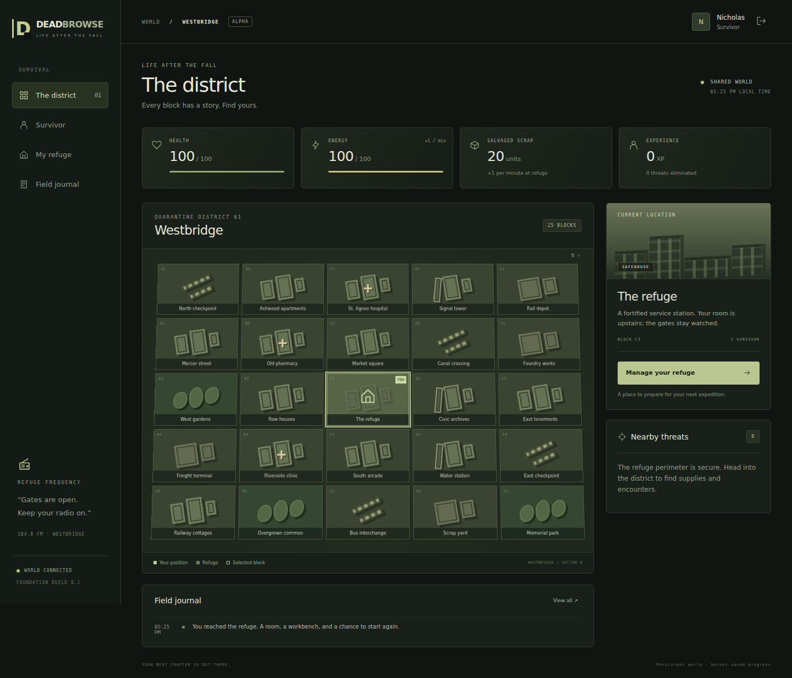

# DeadBrowse

A persistent multiplayer browser RPG inspired by **Torn, Travian, and Urban Dead**. This first playable milestone connects a shared district, individual survivors, scavenging, combat, and a small productive refuge.

**Combat costs energy when you initiate the encounter. Subsequent combat actions do not cost energy.** Movement, inventory, healing, and refuge management do not use a universal action-point pool.



## Run locally

Install **Node.js 24 LTS**. There are no third-party application dependencies and no build step.

```bash
git clone https://github.com/TheMasterStick/DeadBrowse.git
cd DeadBrowse
git checkout codex/persistent-foundation
npm start
```

Open **http://localhost:3000**, create a survivor, and enter the district. Use a second browser profile or private window to create another survivor in the same world. Survivor names use 3–20 letters, numbers, or underscores. Passwords require 10–128 characters.

The SQLite world is saved to `data/deadbrowse.sqlite`. Restarting the application preserves accounts, sessions, character state, production, and unfinished encounters. Back up the database using SQLite's backup tools; do not copy an active WAL database without its associated state. Do not commit player data or credentials.

## Play the first slice

- Select an adjacent map block, then **Travel here**. Travel is immediate and free in this provisional rule set.
- **Search for supplies** outside the refuge. Medical locations provide kits; other locations provide scrap. Searches share a 30-second character cooldown.
- **Initiate attack** against a nearby enemy for 10 energy. Strike, guard, heal, or withdraw during the encounter without further energy costs.
- Defeating an enemy awards scrap and experience. Other survivors see the target as engaged; it cannot be rewarded twice.
- Visit **Survivor** to inspect progress and use medical kits.
- Return to the central refuge to upgrade the workbench. It produces scrap in real time, including up to eight hours between visits.
- **Field journal** records recent actions. All rewards and costs are resolved by the server.

Energy recovers at one point per minute, up to 100. A fight inactive for 15 minutes expires so an offline survivor cannot reserve a target forever. Defeat returns the survivor to the refuge with 50 health. These numbers and the setting are prototype choices, not settled product decisions.

## Verify

```bash
npm run check
npm test
```

The Node test suite covers persistence, account separation, authentication, CSRF/origin checks, duplicate requests, stale-state rejection, shared targets, combat energy, production, healing, and defeat. Tests use isolated temporary or in-memory databases; they do not touch your saved game.

For the optional real-browser smoke test, install the development dependency and Chromium:

```bash
npm ci
npx playwright install chromium
npm run test:browser
```

The smoke test runs its own isolated server and two browser sessions. Screenshots go to ignored `test-results/`. Set `CHROMIUM_PATH` only if using an already installed Chromium executable.

## Hosting

This is a real Node server, **not a static website**. GitHub Pages cannot run its backend. Start with one Node process and persistent local storage. Put it behind an HTTPS reverse proxy for remote play.

| Variable        | Default                  | Purpose                                                                        |
| --------------- | ------------------------ | ------------------------------------------------------------------------------ |
| `HOST`          | `127.0.0.1`              | Listen interface; use `0.0.0.0` behind your proxy/container                    |
| `PORT`          | `3000`                   | HTTP port                                                                      |
| `DB_PATH`       | `data/deadbrowse.sqlite` | Persistent SQLite path                                                         |
| `NODE_ENV`      | unset                    | `production` enables Secure session cookies                                    |
| `PUBLIC_ORIGIN` | local request origin     | Exact external origin, e.g. `https://play.example.com`; required in production |

Production requires HTTPS, a persistent database volume, backups, and a configured `PUBLIC_ORIGIN`. This milestone is suitable for local and controlled small-group testing, not an unattended public launch. Account recovery, distributed rate limiting, moderation, and large-scale load testing remain future work.

See [design decisions](docs/DESIGN.md), [architecture](docs/ARCHITECTURE.md), and [progress](PROGRESS.md). No framework, cloud service, AI API, or paid asset is required to run it. Playwright is a development-only dependency for browser tests.
